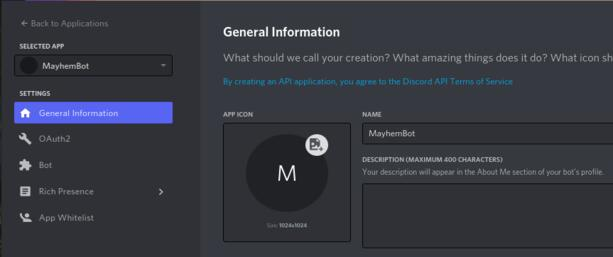
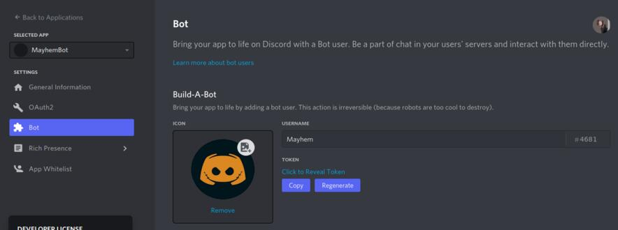
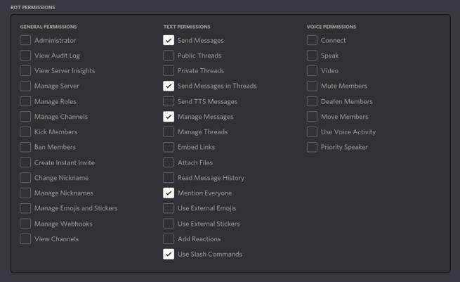
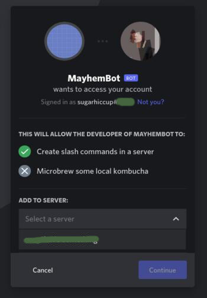

# MAYHEM - a Discord bot written using `discord.js`  

OBJECTIVE: A discord bot for my friends. It's fun and cozy.

[11]: https://discord.com
[12]: https://discord.com/developers/applications

# INSTALLATION  

## CREATE BOT APPLICATION AND GENERATE TOKEN  

Now, we have to create a bot application through your [Discord account][11] (Make one, we need it!). The steps are as follows:  

1. Login and open the [Discord Developer Portal][12].  
2. Click on the "New Application" button.  
3. Enter a name and click "Create" button to confirm.   

<!-- Logged in discord dev portal ss -->


You are free to edit other information as you wish on this page. We'll leave it to defaults. Then navigate to the "Bots" tab and click "Add Bot" button. 



Clicking on "Reveal Token" will show your bot token. A **Token** is a unique identifier for your bot application and is used by Discord to authorize your bot to actually log in and appear online in a server. 

**CAUTION**: It is very important that you keep your token safe and secret. You must not mistakenly commit it to a public repo or such. The consequences can be disastrous. If the key got leaked by mistake, immediately click on "Regenerate token" to generate a new token and invalidate all previous tokens.   

**WARNING**: Make sure you copy the "Bot Token" and not the "Client Secret" or the "Client Key" which are on the Applications page.   

## GENERATE BOT INVITE LINK  

### Bot invite links explained  

A typical invite link looks like this:

```
https://discord.com/api/oauth2/authorize?client_id=123456789012345678&permissions=0&scope=bot%20applications.commands
```  

The fields that need elaboration are the query parameters which are as follows:  

* `client_id`: The client id is the application that is authorized.  
* `permissions`: an integers which encodes the bot's permissions on the server in binary.  
* `scope=bot`: Yes, this is a bot invite link.  
* `applications.commands`: To enable Discord to allow `/` (slash) to invoke bot commands.  

Head over to the OAuth2 page, scroll down and select `applications.commands` and `bot`. Then, choose permissions that you want your bot to have. The page handily generates the link for you.   



Here, I show the permissions for our bot. As you can see, it is a fairly less-demanding bot in terms of administrative privileges.  



Paste the generated link and you will be asked to authorize the server. Note: You can add them to servers in which _you_ have admin access only. If successful, you're greeted by a confirmation dialog. Congratulations, now you can see Mayhem online with a "BOT" tag!  

### HOSTING / DEPLOYMENT

Now, that you have logged the bot application, it is time to host the bot somewhere. You can even host it on your machine (theoretically) but that is not recommended. Maybe, a dedicated Raspberry will work for medium-load usage.  

I host my bot on [replit][0]. Sign up, connect with your github, upload the code and run!   

NOTE: You may need to setup a manual ping on every 30 minutes. See [Uptimerobot][1] for a free but limited service. The reason is that a regular repl will sleep after ~30 minutes. Alternatively, for "Always Active" repl, you have to sign up for a [Repl Hacker Plan][2].  

## CONTRIBUTING  

PRs are always welcome. Raise issues and feature requests in GH issues.  

## LICENSE

MIT Licensed.  

Check the LICENSE file included in this repo for details.

[0]: https://replit.com
[1]: https://uptimerobot.com
[2]: https://replit.com/site/pricing